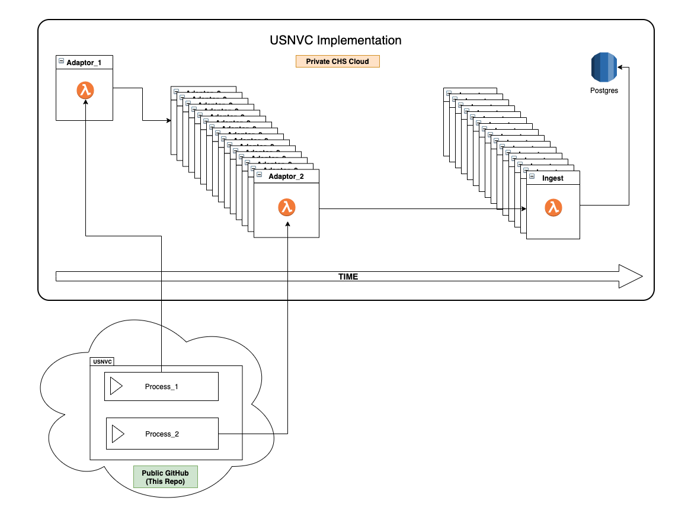

# USNVC Data Processing Pipeline
Externalized USNVC logic for consumption by the bis data pipeline. 




## To Run Locally
-  In `usnvc.py` uncomment the code surrounding the `main()` method.
- For convince, included in this project is the source data object originating from ScienceBase
- ```
    python3 usnvc/usnvc.py
    ```

## Structure 
- A pipeline processing package should have an entry file which we will infer the pipeline name from.
- The package can implement any number of process methods, however, the developer should strive to use the minimum number required.
- The processing methods should be named `process_1(...)`, `process_2(...)`, . . . , `process_nn(...)` ect.
- A process method must take less then 15 minutes to execute. If it takes more consider breaking the logic out into an additional step. 
- Total dependencies should be less then 250MB
- Each process method has an identical signature described below.


##  Method Signature for `process_nn()`
### Inputs
- `path`: The location of source data requested by this pipeline
- `file_name`: The name of the source data file or directory
- `ch_ledger`: An instance of the change leger class.
    - Example: ch_ledger.log_change_event("Field Creation", "Creating feature_id field from REG_NUM", source_data, changed_data)
- `send_final_result`: Instance of a method that accepts a python object representation of a single row of completed, processed data
- `send_to_stage`: Instance of a method that accepts a python object representation of a single row of data that will be processed by the next stage and the integer stage to send it to. 
- `previous_stage_result`: The python object from the previous stage provided by the developer when calling send_to_stage.
### Outputs
-  A single integer representing the number of rows manipulated by the method.

## Notes on `send_final_result()`
- It is the responsibility of the domain expert to verify the documents produced as it relates to the subject.
- We do validate that these documents are valid json in our ingestible schema.
- If a row fails `send_final_result` returns the json schema validation error. Otherwise it returns None.
- In the case of USNVC that document looks like the following.
```
{
  "source_data": any
  "row_id": unique string
}
```
- The row_id is a string key provided by the developer 
- The full schema validation run against each document is as follows.
```
{
  "definitions": {},
  "$schema": "http://json-schema.org/draft-07/schema#",
  "$id": "http://example.com/root.json",
  "type": "object",
  "title": "The Root Schema",
  "required": [
    "source_data",
    "row_id",
  ],
  "properties": {
    "data": {
      "$id": "#/properties/data",
      "type": "object",
      "title": "The Data Schema",
      "required": [
        "feature_id",
        "feature_name",
        "feature_description",
        "feature_class"
      ],
      "properties": {
        "feature_id": {
          "$id": "#/properties/data/properties/feature_id",
          "type": "string",
          "title": "The Feature_id Schema",
          "default": "",
          "examples": [
            ""
          ],
          "pattern": "^(.*)$"
        },
        "feature_name": {
          "$id": "#/properties/data/properties/feature_name",
          "type": "string",
          "title": "The Feature_name Schema",
          "default": "",
          "examples": [
            ""
          ],
          "pattern": "^(.*)$"
        },
        "feature_description": {
          "$id": "#/properties/data/properties/feature_description",
          "type": "string",
          "title": "The Feature_description Schema",
          "default": "",
          "examples": [
            ""
          ],
          "pattern": "^(.*)$"
        },
        "feature_class": {
          "$id": "#/properties/data/properties/feature_class",
          "type": "string",
          "title": "The Feature_class Schema",
          "default": "",
          "examples": [
            ""
          ],
          "pattern": "^(.*)$"
        }
      }
    },
    "source_data": {
      "$id": "#/properties/source_data",
      "type": "object",
      "title": "The Source_data Schema"
    },
    "row_id": {
      "$id": "#/properties/row_id",
      "type": "string",
      "title": "The row_id Schema",
      "default": "",
      "examples": [
        ""
      ],
      "pattern": "^(.*)$"
    },
    "geometry": {
      "$id": "#/properties/geometry",
      "type": "object",
      "title": "The Geometry Schema",
      "required": [
        "geometry"
      ],
      "properties": {
        "geometry": {
          "$id": "#/properties/geometry/properties/geometry",
          "type": "object",
          "title": "The Geometry Schema",
          "required": [
            "type",
            "coordinates"
          ],
          "properties": {
            "type": {
              "$id": "#/properties/geometry/properties/geometry/properties/type",
              "type": "string",
              "title": "The Type Schema",
              "default": "",
              "examples": [
                ""
              ],
              "pattern": "^(.*)$"
            },
            "coordinates": {
              "$id": "#/properties/geometry/properties/geometry/properties/coordinates",
              "title": "The Coordinates Schema"
            }
          }
        }
      }
    },
    "srid": {
      "$id": "#/properties/srid",
      "type": "integer",
      "title": "The Srid Schema",
      "default": 0,
      "examples": [
        0
      ]
    }
  }
}
```
